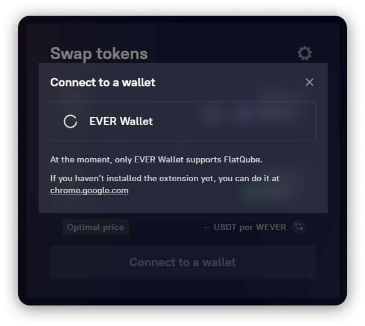
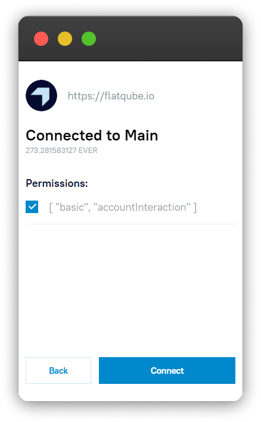

# How to connect a wallet

To start working with FlatQube, you need to connect a wallet. At the moment, the only wallet available for connection is [EVER Wallet](https://l1.broxus.com/everscale/wallet).

If you do not have EVER Wallet yet, we recommend that you go to the [installation instructions](https://docs.tonbridge.io/ever-wallet/getting-started-with-ton-crystal-wallet) or go directly to the [download page](https://l1.broxus.com/everscale/wallet).

## Steps to connect your wallet on desktop

As soon as you enter FlatQube, you will see the **Connect Wallet** button.

Click on it to connect your Ever Wallet.

 (3).png>)

If your device does not have EVER Wallet installed, you will see a window with a download link:

If EVER Wallet is installed, you will see a window for selecting an account to connect to.


Sometimes other browser extensions block the EVER Wallet window. In such a situation, just click on its icon on your toolbar to display the pending authorizations.


Choose one of them (FlatQube will work with the address of this account only) and click **Next**.

.png>)

Select all **permissions** and click **Connect**.

If the connection was successful, you will see the wallet address and the amount of EVER in the right upper corner. By clicking on the "Door" icon you can disconnect this wallet from FlatQube.

## Steps to connect your wallet on mobile

To connect your EVER Wallet on mobile, open the EVER Wallet app and go to the <mark style="color:green;">**Browser section**</mark> at the bottom of the screen. Go to [FlatQube.io ](https://flatqube.io)and click **Connect Wallet** and then confirm this action by clicking **Allow**.

.png>)

Well done!
