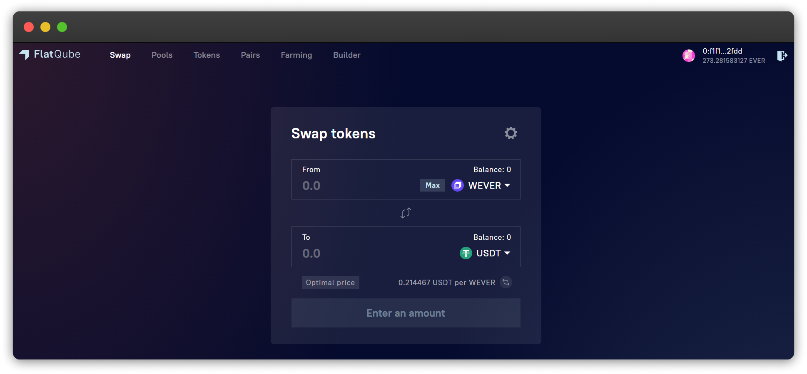

# Interface

So, we've come to the Swap section. Let's examine each element of the interface in detail.

In the upper right part of the swap window, you can see a gear⚙️\*\*.\*\* This is a link to **Transaction Settings.**\
\*\*\*\*Here you can set the [**slippage tolerance**](how-to/configure-slippage-tolerance.md).

.png>)

**From** - is the amount of tokens that will be converted into a certain amount of other tokens - **To.**\
\*\*\*\*Click on **Max** to select all exchangeable tokens.

.png>)

After selecting a certain amount of tokens in **From** or **To**, a few more informative lines will appear:

* \*\*\*\*[**Slippage tolerance**](how-to/configure-slippage-tolerance.md) \*\*\*\* - it is the difference between the expected price of the token and its price at the time of the transaction. By changing this parameter, you can set the maximum slippage when making a transaction. That is, the transaction will not go through if the price of the token at the time of its completion changes by more than the specified percentage.
* **Minimum receive -** the minimum amount of tokens you will receive, taking into account Slippage tolerance
* **Price impact** - the change in the price of the underlying asset caused by this swap.
* **Liquidity Provider Fee** - the amount of tokens that will be distributed in the form of a commission among all users (Liquidity providers) who provided liquidity to the pool of the pair you are exchanging.
* **Optimal price** is the ratio of the price of the tokens you are going to exchange.\
  By clicking on the 🔁, you can choose the ratio of which token to another will be displayed.

.png>)
